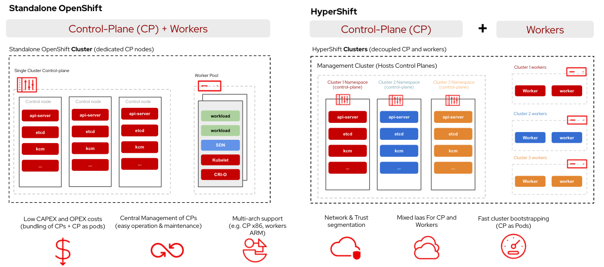

# HyperShift

HyperShift is middleware for hosting [OpenShift](https://www.openshift.com/) control
planes at scale that solves for cost and time to provision, as well as portability
cross cloud with strong separation of concerns between management and workloads.
Clusters are fully compliant [OpenShift Container Platform](https://www.redhat.com/en/technologies/cloud-computing/openshift/container-platform) (OCP)
clusters and are compatible with standard OCP and Kubernetes toolchains.

To get started, visit [the documentation](https://hypershift-docs.netlify.app/).



### provision and destroy with custom resources
#### Pre-step
1. Connect to OpenShift
2. Install hypershift 
    ```bash
    hypershift install --oidc-storage-provider-s3-bucket-name=my-s3-bucket --oidc-storage-provider-s3-region=us-east-1
    ```
3. Run the Hypershift operator from the command line
    ```shell
    # Find the `operator` deployment in the hypershift namespace, set replicas to 0
    # Then run the following command to have the operator run locally through your connection

    go run ./hypershift-operator run \
      --oidc-storage-provider-s3-bucket-name=my-s3-bucket \
      --oidc-storage-provider-s3-region=us-east-1 \
      --namespace=hypershift \
      --oidc-storage-provider-s3-credentials=$HOME/.aws/credentials

    # Substitute in your s3 bucket name, AWS region and AWS credential values
    ```
4. Create the namespace `clusters`
    ```bash
    oc new-project clusters
    ```
5. In the `clusters` namespace, create an AWS Cloud Provider secret (ACM format)
  ```yaml
  ---
  apiVersion: v1
  kind: Secret
  type: Opaque
  metadata:
    name: aws
    namespace: clusters
  stringData:
    aws_access_key_id: AWS_ID_KEY
    aws_secret_access_key: AWS_SECRET_KEY
  ```
3. In the `clusters` namespace, create a pull secret (ACM/Hive format)
  ```yaml
  ---
  apiVersion: v1
  kind: Secret
  metadata:
    name: pull-secret
    namespace: clusters
  stringData:
    .dockerconfigjson: |-
      {"auths": MY_PULL_SECRET }
  type: kubernetes.io/dockerconfigjson
   ```
#### Deploying Hypershift HostedClusters
1. Edit the file `./examples/cluster-demo/providerplatform.yaml` and set the `base-domain` value
2. Make any changes you want to the `hostedcluster.yaml` and `nodepool.yaml`, the defaults will work
3. Apply the three resources `ProviderPlatform`, `HostedCluster` & `NodePool` 
  ```bash
  oc apply -f examples/cluster-demo/
  ```
7. It will take 5-6min for the deploy to complete!
8. To clean up delete the three resources
    ```bash
    oc delete -f examples/cluster-demo/
    ```

